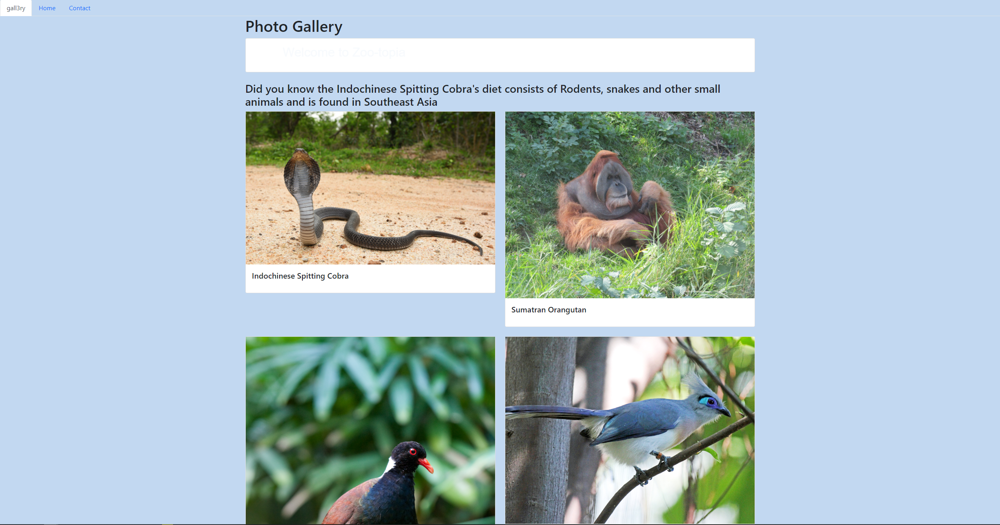

# Zoo animal photo-gallery
Project files for Final School project phase 1

## Technologies Used
- HTML & CSS (Bootstrap)
- Javascript
- Zoo animal api [https://zoo-animal-api.herokuapp.com]
## Requirements
Internet connection to display the bootstrap styling
## Setup Instructions and Installation
- Have an internet connection for the api to work
- Fork the application and navigate to the folder
- Open index.html file in browser
## Known Bugs
N/A

### License
MIT Licence
### Author
Ochieng Okeyo Phillip
